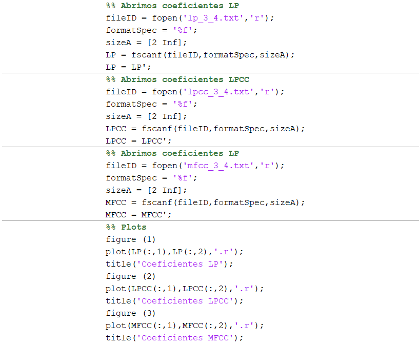
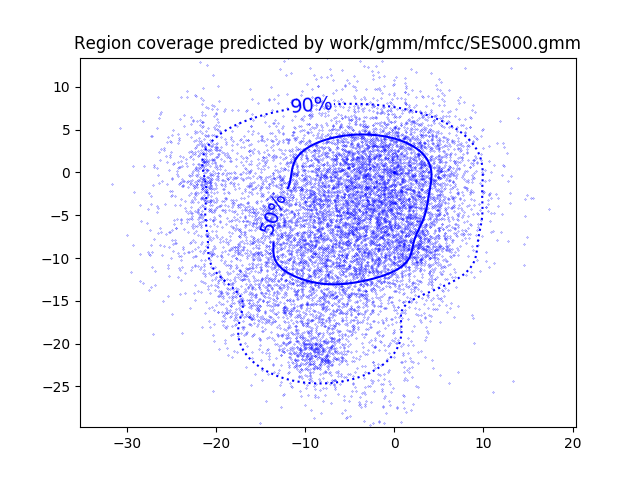
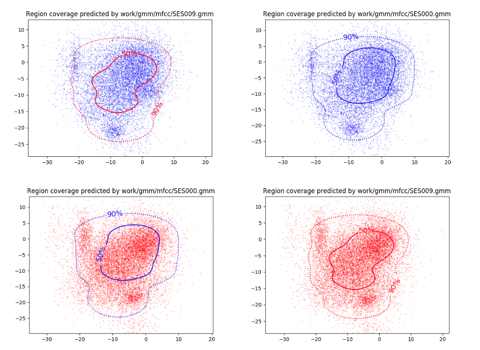

PAV - P4: reconocimiento y verificación del locutor
===================================================

Obtenga su copia del repositorio de la práctica accediendo a [Práctica 4](https://github.com/albino-pav/P4)
y pulsando sobre el botón `Fork` situado en la esquina superior derecha. A continuación, siga las
instrucciones de la [Práctica 3](https://github.com/albino-pav/P3) para crear una rama con el apellido de
los integrantes del grupo de prácticas, dar de alta al resto de integrantes como colaboradores del proyecto
y crear la copias locales del repositorio.

También debe descomprimir, en el directorio `PAV/P4`, el fichero [db_spk.tgz](https://atenea.upc.edu/pluginfile.php/3008277/mod_assign/introattachment/0/db_spk.tgz?forcedownload=1)
con la base de datos oral que se utilizará en la parte experimental de la práctica.

Como entrega deberá realizar un *pull request* con el contenido de su copia del repositorio. Recuerde
que los ficheros entregados deberán estar en condiciones de ser ejecutados con sólo ejecutar:

~~~~~~~~~~~~~~~~~~~~~~~~~~~~~~~~~~~~~~~~~~~~~~~~~~~~~.sh
  make release
  run_spkid mfcc train test classerr verify verifyerr
~~~~~~~~~~~~~~~~~~~~~~~~~~~~~~~~~~~~~~~~~~~~~~~~~~~~~

A modo de memoria de la práctica, complete, en este mismo documento y usando el formato *markdown*, los
ejercicios indicados.

## Ejercicios.

### Extracción de características.

- Escriba el *pipeline* principal usado para calcular los coeficientes cepstrales de predicción lineal
  (LPCC), en su fichero <code>scripts/wav2lpcc.sh</code>:
  
> El pipeline siguiente es el usado para calcular los coeficientes de predicción lineal (LPCC) en el 
  script wav2lpcc.sh:
~~~~~~~~~~~~~~~~~~~~~~~~~~~~~~~~~~~~~~~~~~~~~~~~~~~~~~~~~~~~~~~~~~~~~~~~~~~~~~~~~~~~~~~~~~~~~~~~~.sh
  sox $inputfile -t raw - dither -p12 | $X2X +sf | $FRAME -l 200 -p 40 | $WINDOW -l 200 -L 200 |
	$LPC -l 200 -m $lpc_order | $LPCC -m $lpcc_order -M $cepstrum_order > $base.lpcc
~~~~~~~~~~~~~~~~~~~~~~~~~~~~~~~~~~~~~~~~~~~~~~~~~~~~~~~~~~~~~~~~~~~~~~~~~~~~~~~~~~~~~~~~~~~~~~~~~
> En el imputfile hemos puesto la señal de audio grabada en la primera pràctica llamada pav_4393.wav, 
  la convertimos a raw, calculamos sus coeficientes LPCC y los guardamos en un fichero.lpcc.
    
- Escriba el *pipeline* principal usado para calcular los coeficientes cepstrales en escala Mel (MFCC), en
  su fichero <code>scripts/wav2mfcc.sh</code>:

> El pipeline siguiente es el usado para calcular los coeficientes en l'escala Mel Cepstrum (MFCC) en 
  el script wav2mfcc.sh:
~~~~~~~~~~~~~~~~~~~~~~~~~~~~~~~~~~~~~~~~~~~~~~~~~~~~~~~~~~~~~~~~~~~~~~~~~~~~~~~~~~~~~~~~~~~~~~~~~.sh
  sox $inputfile -t raw - | $X2X +sf | $FRAME -l 200 -p 40 | $WINDOW -l 200 -L 200 |
	$MFCC -l 200 -m $mfcc_order -n $filters -s $frequency > $base.mfcc
~~~~~~~~~~~~~~~~~~~~~~~~~~~~~~~~~~~~~~~~~~~~~~~~~~~~~~~~~~~~~~~~~~~~~~~~~~~~~~~~~~~~~~~~~~~~~~~~~
> En el imputfile hemos puesto la señal de audio grabada en la primera pràctica llamada pav_4393.wav, 
  la convertimos a raw, calculamos sus coeficientes MFCC y los guardamos en un fichero.mpcc.
    
- Indique qué parámetros considera adecuados para el cálculo de los coeficientes LPCC y MFCC.
  
 > **PARÁMETROS LPCC**
 > - lpc_order=8
 > - lpcc_order=8
 > - cepstrum_order=8
 > 
 > **PARÁMETROS MFCC**
 > - mfcc_order=8
 > - filters=20
 > - frequency=8kHz

- Inserte una imagen mostrando la dependencia entre los coeficientes 2 y 3 de las tres parametrizaciones
  para una señal de prueba.
  
  
  
  > Los coeficientes están muy correlados por lo que no nos sirven tanto para la clasificación.
  
  
  
  > Al obtener los coeficientes cepstrales LPCC estos son más incorrelados por lo que son más adecuados para
    la clasificación.
    
  
  
  > Debido a que la percepción del oído humano no sigue la escala de frecuencias, es mejor cuando muestreamos 
    la señal a la escala mel. Estos coeficientes son los más incorrelados, serán los mejores para la 
    clasificación.
  
  + ¿Cuál de ellas le parece que contiene más información?
 >  La parametrización cuyos coeficientes tiene más información es la del MFCC, es el que nos proporciona los 
    coeficientes más incorrelados. Para la dependencia entre el LP y el LPCC hemos de coger los coeficientes 3 
    y 4, mientras para el MFCC el 2 y 3. Para generar la gráfica de dependencia entre los coeficientes hemos 
    utilizado el matlab siguiente aplicado a un mismo archivo de audio.
          
   
  
- Usando el programa <code>pearson</code>, obtenga los coeficientes de correlación normalizada entre los
  parámetros 2 y 3, y rellene la tabla siguiente con los valores obtenidos.

  |                        | LP   | LPCC | MFCC |
  |------------------------|:----:|:----:|:----:|
  | &rho;x[2,3] |-0.654|0.2867|0.0799|
  | &rho;x[3,4] |-0.586|0.4439|0.0803|
  
 > Podemos ver como con Pearson también son más incorrelados los valores de MFCC. Para cada Feature se muestra el valor de la autocovarianza normalizada seguida de rho[feature][cof]. Estos valores dentro de cada feature están ordenados de mayor a menor según su valor absoluto. Cogemos el el [2,3] para evaluar el MFCC y el [3,4] para el LP y LPCC.

 >  

 >  
 
 >  
 
  
  + Compare los resultados de <code>pearson</code> con los obtenidos gráficamente.
 > Al igual que hemos podido observar con las gráficas, los coeficientes MFCC son los que presentan una mayor incorrelación. Podemos ver que sus valores son mucho menores a los de LP o LPCC. Comprobamos así que el más útil para la clasificación nos sera el MFCC, ya que presenta valores más distintos.
 
### Entrenamiento y visualización de los GMM.

- Inserte una gráfica que muestre la función de densidad de probabilidad modelada por el GMM de un locutor
  para sus dos primeros coeficientes de MFCC.
  
   
  
- Inserte una gráfica que permita comparar los modelos y poblaciones de dos locutores distintos. Comente el
  resultado obtenido y discuta si el modelado mediante GMM permite diferenciar las señales de uno y otro.
  
  
  
  > Vemos que en las gráficas superiores tenemos el modelo azul, primero con la clasificación del otro modelo y con su propio modelo. En las gráficas inferiores vemos lo mismo invertido. Vemos que si utilizamos el modelo de color azul sobre el rojo el resultado es aceptable, mientras que si aplicamos la clasificación del modelo rojo sobre el azul (como vemos en la primera imagen) el resultado es peor. El modelo GMM genera un modelo muy especifico para cada uno, en nuestro caso no hay mucha diferencia por lo que funciona bien al aplicarse sobre otros modelos. Aún así, depende mucho del modelo utilizado.

### Reconocimiento del locutor.

- Inserte una tabla con la tasa de error obtenida en el reconocimiento de los locutores de la base de datos
  SPEECON usando su mejor sistema de reconocimiento para los parámetros LP, LPCC y MFCC.
  
  |              | LP   | LPCC | MFCC |
  |--------------|:----:|:----:|:----:|
  |Tasa de error | 3.57%| 0.51%| 0.00%|
  
  > Hemos conseguido las tasas de error anteriores utilizando 600 gaussianas, 30 iteraciones y un threshold de 0.0001. La inicialización se ha realizado con el algoritmo VQ, concretando -i 1 en el gmm_train.

### Verificación del locutor.

- Inserte una tabla con el *score* obtenido con su mejor sistema de verificación del locutor en la tarea
  de verificación de SPEECON. La tabla debe incluir el umbral óptimo, el número de falsas alarmas y de
  pérdidas, y el score obtenido usando la parametrización que mejor resultado le hubiera dado en la tarea
  de reconocimiento.
  
  |        	   | LP   | LPCC | MFCC |
  |----------------|:----:|:----:|:----:|
  | Score 	   | 70.3%|  9.2%|  00% |
  | Umbral óptimo  | 0.857| 0.656|000.00|
  | Falsa alarma   | 0.001| 0.000| 0.000|
  | Pérdidas       | 0.604| 0.092| 0.000|
 
### Test final y trabajo de ampliación.

- Recuerde adjuntar los ficheros `class_test.log` y `verif_test.log` correspondientes a la evaluación
  *ciega* final.

- Recuerde, también, enviar a Atenea un fichero en formato zip o tgz con la memoria con el trabajo
  realizado como ampliación, así como los ficheros `class_ampl.log` y/o `verif_ampl.log`, obtenidos como
  resultado del mismo.
